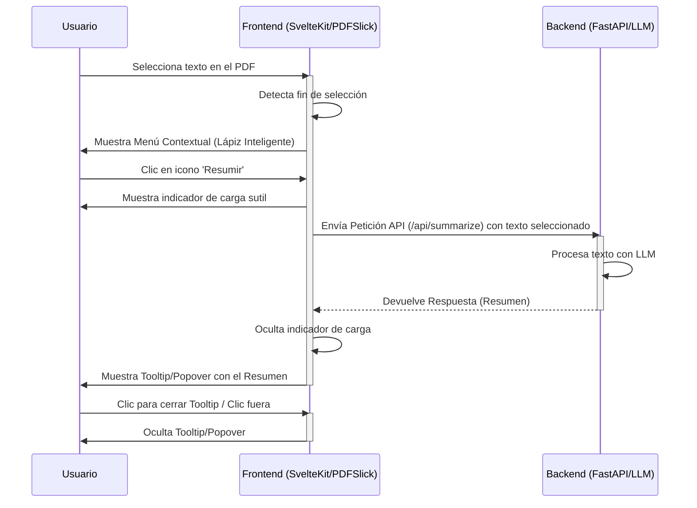

# **Reporte de Estado UI/UX - PDFIndex (Abril 2025)**

**Preparado por:** Tu Asistente Personal UI/UX

**Fecha:** 26 de Abril, 2025

**Versión:** 1.0

**Audiencia:** Equipo de Desarrollo Técnico de PDFIndex

**Asunto:** Evaluación del estado actual del diseño de la interfaz de usuario y la experiencia del usuario para el MVP de PDFIndex, y recomendaciones estratégicas para los próximos pasos.

---

## 1. Resumen Ejecutivo

El proyecto PDFIndex ha mostrado una **evolución notable y muy positiva** en su interfaz de usuario (UI) y experiencia de usuario (UX) preliminar, específicamente en lo que respecta a la *landing page* o punto de entrada inicial. Hemos pasado de un estado muy básico a un diseño **visualmente coherente, profesional y alineado con la identidad de marca** establecida. Los puntos fuertes actuales incluyen una paleta de colores consistente y bien aplicada, una jerarquía visual clara, y llamadas a la acción (CTAs) efectivas.

Sin embargo, el enfoque ahora debe transicionar urgentemente hacia el **diseño detallado de la experiencia *dentro* de la aplicación**: la visualización del PDF y, crucialmente, la interacción con el "Lápiz Inteligente Contextual", que es el corazón de la propuesta de valor diferenciadora de PDFIndex.

Este reporte detallará la evolución del diseño, analizará el estado actual frente a las necesidades de nuestras personas de usuario clave, describirá los flujos de usuario fundamentales, y proporcionará recomendaciones priorizadas para asegurar que el MVP no solo sea funcional técnicamente, sino también **intuitivo, usable y atractivo** para nuestros usuarios objetivo iniciales. La colaboración continua entre diseño y desarrollo será clave para materializar la visión de PDFIndex.

---

## 2. Contexto del Proyecto y Objetivos UX

Recordemos brevemente el núcleo de PDFIndex:

*   **Producto:** Aplicación web para leer, procesar y analizar archivos PDF utilizando Inteligencia Artificial (IA) a través de un Modelo de Lenguaje Grande (LLM).
*   **Propuesta de Valor Clave:** Facilitar la comprensión y extracción de información de PDFs de manera más rápida y eficiente mediante interacciones contextuales impulsadas por IA ("Lápiz Inteligente").
*   **Objetivo del MVP:** Lanzar una versión funcional que demuestre el valor central de la lectura de PDF asistida por IA a un grupo inicial de usuarios (testers/early adopters), validando la tecnología y la experiencia de usuario básica.
*   **Arquitectura:** Basada en un modelo MVC (confirmado por documentación), con un Frontend (SvelteKit + PDFSlick) y un Backend (FastAPI).

**Personas de Usuario Clave (Recordatorio):**

Nuestra estrategia de diseño debe estar guiada por las necesidades de nuestras personas primarias, especialmente para el MVP:

1.  **Sofía Reyes (Investigadora Estudiantil):** Necesita eficiencia en la lectura, búsqueda robusta, y anotación/resaltado simple para sintetizar información académica densa. La IA para resumir y explicar es de alto valor. *Prioridad Alta para MVP.*
2.  **David Chen (Profesional Ocupado):** Valora la rapidez para revisar, comentar, llenar formularios básicos y firmar. Busca eficiencia y profesionalismo. La IA para extracción rápida de puntos clave y respuestas es útil. *Prioridad Alta para MVP.*
3.  **María García (Lectora Casual):** Busca simplicidad, rapidez y fiabilidad. Necesita abrir y leer PDFs sin fricción. Menos probable que sea una usuaria intensiva de IA inicialmente, pero se beneficia de una interfaz limpia y performante. *Prioridad Media/Baja para las *funciones avanzadas* del MVP, pero Alta para la *usabilidad básica*.

**El objetivo principal de UX para el MVP es entregar una experiencia fluida y de bajo esfuerzo para las tareas centrales de Sofía y David relacionadas con la interacción IA contextual, sobre una base sólida de lectura de PDF rápida y fiable que también satisfaga a María.**

---

## 3. Evolución del Diseño y Estado Actual (Landing Page)

Hemos recorrido un camino significativo en la definición visual de PDFIndex:

*   **Estado Inicial (Pre-Feedback):**
    *   Interfaz extremadamente básica, casi un volcado de texto sin estructura visual clara.
    *   Uso de la paleta de colores original (`#8a7769`, `#faf4ea`, `#747C71`) solo presente en el logo conceptual. No aplicada a la UI.
    *   Falta total de jerarquía, atractivo visual o guía para el usuario.
    *   *Evaluación UX:* Muy pobre. No comunicaba valor, profesionalismo ni facilidad de uso. Alto riesgo de abandono inmediato.

*   **Estado Intermedio (Post-Feedback Inicial):**
    *   **Mejoras:** Introducción de estructura (Hero, Features, CTA), uso de tarjetas, intento de layout.
    *   **Problemas Persistentes:**
        *   *Desconexión de Marca:* Uso de una paleta de colores ajena (fondo azulado/grisáceo).
        *   *Logo:* Pequeño, con un color rojo incorrecto/discordante en "Index".
        *   *CTAs Débiles:* Botones "fantasma" (contorno) para acciones primarias, con bajo contraste y poca fuerza visual.
        *   *Hover Inconsistente:* Uso de un amarillo brillante no perteneciente a la paleta para efectos hover.
    *   *Evaluación UX:* Un paso adelante en estructura, pero fallaba críticamente en coherencia de marca, claridad visual y principios de accesibilidad (contraste en CTAs). Aún se sentía genérico y poco pulido.

*   **Estado Actual (Última Captura Revisada - ¡Gran Mejora!):**
    *   **Diseño General:** Profesional, limpio, moderno y **visualmente coherente**.
    *   **Paleta Aplicada:**
        *   Fondo principal claro (`#faf4ea` o similar), transmitiendo calidez y limpieza.
        *   Cabecera oscura (azul/gris sofisticado), creando un buen contraste y anclaje visual superior.
        *   Uso del color claro del fondo en los botones de icono de la cabecera, integrándolos perfectamente.
    *   **Logo Corregido:** Tamaño adecuado, colores correctos, bien integrado en la cabecera oscura. Ahora representa la marca.
    *   **CTAs Efectivos:**
        *   Botón Primario ("Sube un PDF ahora"): Sólido, usando el color oscuro de la cabecera como acento principal. Claro, prominente y con buen contraste.
        *   Botón Secundario ("Ver Demo Rápida"): Estilo de contorno claro, subordinado al primario. Jerarquía correcta.
    *   **Cabecera Refinada:** Uso de iconos (Documento, Usuario) en lugar de texto. Más limpio, moderno e intuitivo para acciones comunes. Elimina la ambigüedad y el desorden.
    *   **Ventana Demo:** Limpia, sin elementos discordantes (puntos de colores).
    *   *Evaluación UX:* **Excelente progreso.** La landing page ahora comunica profesionalismo, confianza y claridad. Establece una base visual sólida y atractiva para la primera impresión del usuario.

**En resumen:** La landing page actual es un **activo fuerte** para el proyecto. Refleja bien la identidad de marca y aplica principios sólidos de UI/UX.

---

## 4. UI/UX Strengths del Diseño Actual (Landing Page)

*   **Coherencia de Marca:** Excelente uso de la paleta de colores definida y el logo corregido.
*   **Jerarquía Visual Clara:** El tamaño y peso de la tipografía, junto con la estructura de secciones, guía al ojo del usuario.
*   **CTAs Fuertes y Claros:** La distinción entre botón primario y secundario es efectiva y guía la acción principal.
*   **Diseño Limpio y Moderno:** Uso generoso de espacio en blanco, iconografía clara en la cabecera, y layout estructurado.
*   **Profesionalismo:** El diseño transmite seriedad y confianza, apropiado para una herramienta de productividad/análisis.
*   **Base para Accesibilidad:** Los botones sólidos mejoran el contraste, aunque se requiere verificación formal.

---

## 5. Flujos de Usuario Clave (Conceptuales para MVP)

Aunque nos hemos centrado en la landing page, es vital pensar en cómo esta conecta con los flujos centrales del MVP:

**Flujo 1: Onboarding y Primera Interacción (Visitante Nuevo)**

1.  **Aterrizaje:** Usuario llega a la landing page (estado actual).
2.  **Comprensión:** Lee el titular y subtítulo (Sección Hero) para entender la propuesta de valor ("Lector Inteligente... Entender Más Rápido"). Ve la demo visual.
3.  **Exploración:** Escanea las características principales (Sección "Presentamos PDFlex...") para entender *cómo* funciona (Resume, Explica, Pregunta).
4.  **Acción Principal:** Se siente convencido y hace clic en el botón primario **"Sube un PDF ahora"**.
5.  **Transición:** *(**NECESITA DISEÑO DETALLADO**) El usuario es dirigido a la interfaz principal de la aplicación, probablemente presentando un mecanismo claro para seleccionar/arrastrar un archivo PDF.*
6.  **Carga:** El usuario sube un PDF.
7.  **Visualización:** El PDF se muestra en la interfaz principal del lector.

**Flujo 2: Lectura e Interacción con IA (Usuario dentro de la App)**

1.  **Visualización:** Usuario está viendo un PDF cargado en la interfaz principal del lector. *(**NECESITA DISEÑO DETALLADO**) Supone un layout con el visor de PDF como elemento central.*
2.  **Identificación:** Encuentra un fragmento de texto que desea entender mejor, resumir o sobre el cual tiene una pregunta.
3.  **Selección:** Selecciona el texto relevante usando el cursor.
4.  **Activación Contextual:** Inmediatamente después de soltar el botón del ratón, aparece el **"Lápiz Inteligente"** - un menú contextual pequeño y discreto cerca del texto seleccionado. *(**NECESITA DISEÑO DETALLADO**)*
5.  **Elección de Acción IA:** El usuario hace clic en un icono dentro del menú contextual (ej: icono de "Resumir", icono de "Explicar", icono de "Preguntar").
6.  **Feedback de Procesamiento:** *(**NECESITA DISEÑO DETALLADO**) Se muestra una indicación visual sutil de que la IA está procesando la solicitud (ej: spinner o animación leve cerca del menú/tooltip).*
7.  **Presentación de Resultados:** *(**NECESITA DISEÑO DETALLADO**) El resultado de la IA (resumen, explicación, respuesta) aparece de forma clara y contextual, probablemente en un tooltip o popover anclado a la selección original o al menú contextual. Debe ser fácil de leer y descartar.*
8.  **Acciones sobre Resultados:** *(**NECESITA DISEÑO DETALLADO**) El tooltip/popover podría incluir acciones rápidas como "Copiar respuesta".*
9.  **Continuación:** El usuario cierra el resultado de IA y continúa leyendo o interactuando con el documento.

---

## 6. Alineación con Personas (Estado Actual y Próximos Pasos)

*   **Landing Page Actual:**
    *   **Sofía:** Atractivo profesional, propuesta de valor clara sobre "entender más rápido". Las características de IA listadas (resumir, explicar) resuenan directamente con sus necesidades de investigación.
    *   **David:** Aprecia la eficiencia comunicada y el aspecto profesional. La promesa de respuestas rápidas y extracción de ideas clave es relevante.
    *   **María:** Se beneficia de la claridad y simplicidad visual. El CTA principal es claro.

*   **Experiencia In-App (Próximos Pasos Críticos):**
    *   **Sofía:** Necesita que el visor de PDF sea performante con documentos largos. El "Lápiz Inteligente" debe ser rápido y preciso para resumir/explicar secciones clave sin interrumpir su flujo de estudio. La facilidad para copiar resultados es vital para sus notas/citas.
    *   **David:** Requiere que la interacción con el "Lápiz Inteligente" sea extremadamente eficiente (pocos clics, respuesta rápida). Los resultados deben ser concisos y accionables. La fiabilidad es clave.
    *   **María:** Necesita que la interfaz del lector sea minimalista y fácil de navegar (zoom, scroll). Aunque use menos la IA, una interfaz recargada o lenta la disuadirá.

**Conclusión de Alineación:** La landing page sienta una buena base para atraer a nuestras personas objetivo. Sin embargo, el **éxito real del MVP dependerá críticamente de la ejecución de la experiencia *dentro* de la aplicación**, especialmente la interacción fluida y útil del "Lápiz Inteligente" para satisfacer las necesidades centrales de Sofía y David.

---

## 7. Foco en el "Lápiz Inteligente Contextual" (Diseño Crítico Pendiente)

Esta es la **joya de la corona** de PDFIndex y donde la experiencia de usuario debe brillar. Su diseño e implementación son cruciales para el éxito del MVP.

**Requerimientos de Diseño UX para el Lápiz Inteligente:**

1.  **Activación Intuitiva:** Debe aparecer automáticamente al seleccionar texto, sin necesidad de acciones adicionales.
2.  **Diseño No Intrusivo:** Pequeño, posicionado cerca de la selección sin ocultar el texto circundante importante. Estéticamente alineado con la UI general.
3.  **Iconografía Clara:** Iconos universalmente comprensibles para cada acción de IA (resumir, explicar, preguntar, etc.). Incluir tooltips al pasar el ratón es esencial.
4.  **Rápida Respuesta Visual:** Feedback inmediato al hacer clic en un icono (estado de carga sutil).
5.  **Presentación de Resultados Contextual:** El tooltip/popover con la respuesta debe ser claro, legible, fácil de descartar y anclado a la selección/menú.
6.  **Rendimiento:** La aparición/desaparición del menú y el tooltip debe sentirse instantánea y fluida.

**Este componente requiere un diseño detallado y prototipado específico.** No podemos permitir que una interacción tan central se sienta torpe, lenta o confusa.

---

## 8. Consideraciones de Accesibilidad

El diseño actual de la landing page ha mejorado en este aspecto gracias a los CTAs sólidos. Sin embargo, para el MVP necesitamos asegurar:

*   **Contraste de Color:** Verificación formal de todos los elementos interactivos y textos con herramientas como WebAIM Contrast Checker (objetivo mínimo WCAG AA).
*   **Navegación por Teclado:** Asegurar que todos los elementos interactivos (botones, enlaces, y especialmente los elementos del Lápiz Inteligente y el visor de PDF) sean accesibles y operables mediante teclado.
*   **Lectores de Pantalla:** Uso adecuado de etiquetas ARIA donde sea necesario, especialmente para los iconos y controles personalizados.
*   **Tamaño de Texto y Objetivos Táctiles:** Considerar la legibilidad y facilidad de interacción en diferentes tamaños de pantalla (si aplica al MVP).

La accesibilidad no debe ser un añadido posterior, sino integrada en el proceso de diseño y desarrollo.

---

## 9. Diagrama de Flujo: Interacción "Lápiz Inteligente"

A continuación, un diagrama de secuencia simplificado usando Mermaid para ilustrar el flujo central de interacción con la IA:

---

## 10. Recomendaciones UI/UX Priorizadas y Próximos Pasos

Para asegurar un MVP exitoso desde la perspectiva del usuario, recomiendo enfocar los esfuerzos de diseño y desarrollo en los siguientes puntos, en orden de prioridad:

1.  **PRIORIDAD CRÍTICA: Diseño Detallado e Implementación de la Interfaz In-App:**
    *   **Acción:** Definir el layout principal del visor de PDF. Diseñar la apariencia y comportamiento exactos del **Menú Contextual (Lápiz Inteligente)** y del **Tooltip/Popover de Resultados de IA**. Prototipar esta interacción clave.
    *   **Resultado Esperado:** Una experiencia fluida, intuitiva y estéticamente coherente para la interacción central con la IA.

2.  **PRIORIDAD ALTA: Diseño del Flujo de Carga de PDF:**
    *   **Acción:** Diseñar cómo el usuario transiciona desde la landing page (clic en "Sube un PDF") a la interfaz de carga. Crear un mecanismo de subida claro (botón, drag-and-drop).
    *   **Resultado Esperado:** Un proceso de carga sin fricciones que lleve al usuario directamente a la visualización del documento.

3.  **PRIORIDAD ALTA: Implementar Feedback Visual Esencial:**
    *   **Acción:** Asegurar indicadores de carga claros (para subida de PDF, procesamiento de IA) y mensajes de éxito/error básicos pero informativos.
    *   **Resultado Esperado:** Una interfaz que se sienta responsiva y mantenga al usuario informado sobre lo que está sucediendo.

4.  **PRIORIDAD MEDIA: Diseño Básico de Acciones de Cabecera (Iconos):**
    *   **Acción:** Definir qué sucede al hacer clic en los iconos de Documento y Usuario en la cabecera (para el MVP, puede ser funcionalidad mínima: el de usuario lleva a un modal de Login/Registro simple, el de documento quizás no haga nada aún o repita la acción de subir).
    *   **Resultado Esperado:** Funcionalidad básica y esperada para los elementos presentes en la cabecera.

5.  **PRIORIDAD MEDIA: Auditoría de Accesibilidad Básica:**
    *   **Acción:** Realizar pruebas de contraste en los nuevos elementos de la UI in-app. Probar la navegación básica por teclado.
    *   **Resultado Esperado:** Cumplimiento de requisitos mínimos de accesibilidad para el lanzamiento a testers.

6.  **PRIORIDAD BAJA (Post-MVP Inicial):** Diseño de funcionalidades secundarias como gestión de archivos ("Mis Documentos"), perfiles de usuario complejos, configuraciones avanzadas, etc.

---

## 11. Conclusión

PDFIndex ha logrado una base visual sólida y profesional con su landing page actual. El equipo ha demostrado una gran capacidad para iterar y mejorar basándose en el feedback. El siguiente paso crítico es **trasladar esta calidad y atención al detalle a la experiencia central dentro de la aplicación**, enfocándose sin descanso en hacer que la interacción con el "Lápiz Inteligente" sea excepcional.

Al priorizar el diseño y la implementación de estos flujos y componentes clave, aseguraremos que el MVP de PDFIndex no solo funcione, sino que también deleite a nuestros primeros usuarios y valide la visión del producto de manera efectiva. La colaboración continua y el enfoque en las necesidades de Sofía y David nos guiarán hacia un lanzamiento exitoso.

---